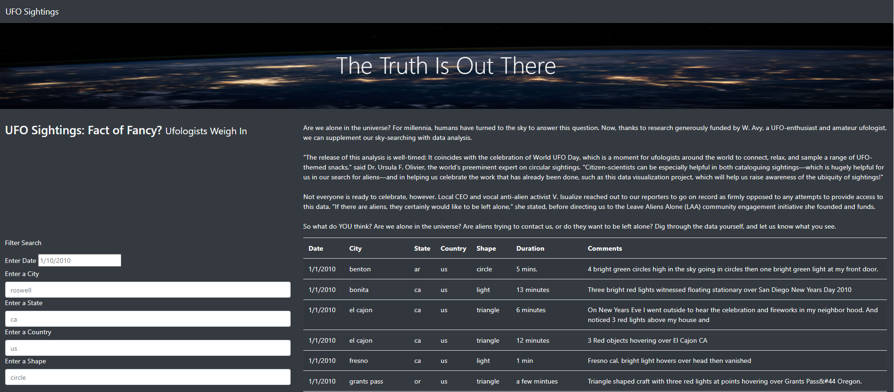
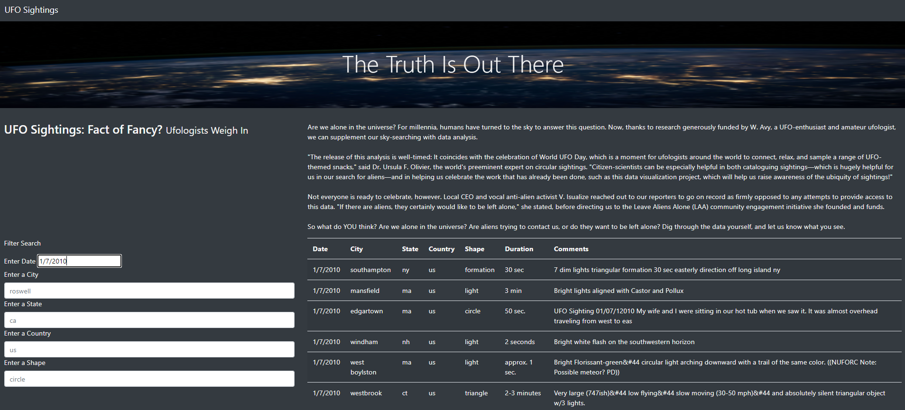
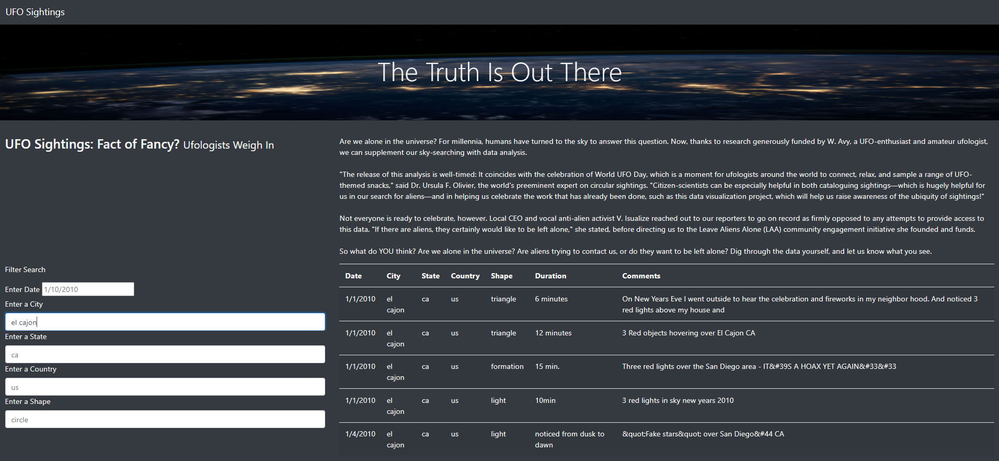
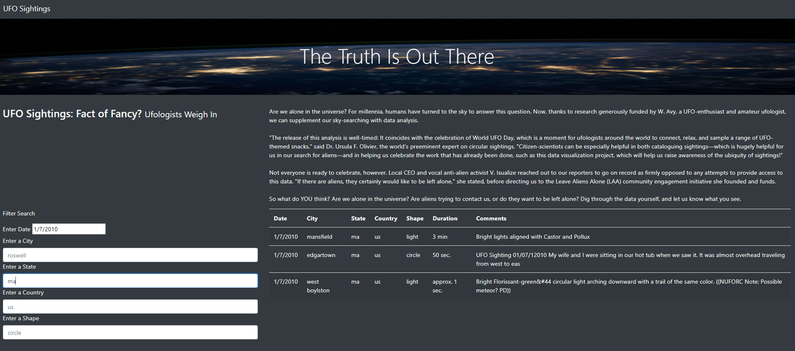
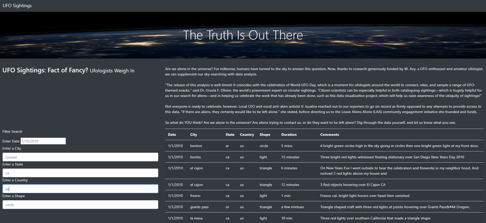
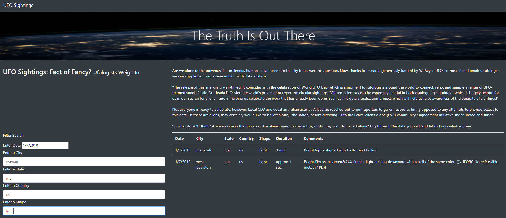

# UFOS
Module 11

## Overview of Analysis:

After creating Dana's UFO Sightings webpage

Dana’s webpage and dynamic table are working as intended, but she’d like to provide a more in-depth analysis of UFO sightings by allowing users to filter for multiple criteria at the same time. In addition to the date, you’ll add table filters for the city, state, country, and shape.

## Resources:

Software: Software: Jupyter Notebook, Anaconda 4.10.1, Python 3.7.6, Visual Studio Code 1.56.0
 
Code: 	[index.html](index.html))  
		[style.css](static/css/style.css)  
		[app.js](static/js/app.js)  
		[app.js](static/js/app.js)  

Resources:	[data.js](static/js/data.js)

Images:	[images](static)			

## Website Images:
  
  
  
  
  
  

## Results:

Overview of Project: Explain the purpose of this analysis.
Results: Describe to Dana how someone might use the new webpage by walking her through the process of using the search criteria. Use images of your webpage during the filtering process to support your explanation.
Summary: In a summary statement, describe one drawback of this new design and two recommendations for further development.